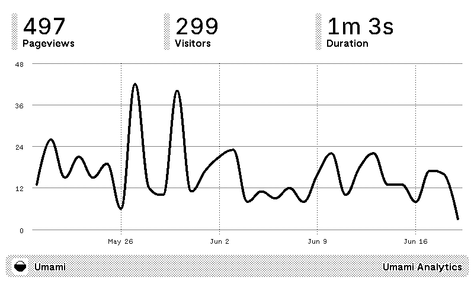

# Umami TRMNL

A TRMNL plugin for [Umami Analytics](https://umami.is).

## Installation

### Via Recipe Fork

1. Go to the [Umami TRMNL Recipe](https://usetrmnl.com/recipes/25370/install)
2. Fork the recipe to your account (top right)

### Import

1. Download the [latest release](https://github.com/nicell/trmnl-umami/releases)'s plugin.zip file
2. Go to your [TRMNL plugin page](https://usetrmnl.com/plugins)
3. Connect Private Plugin if you haven't already
4. Go to [Private Plugin](https://usetrmnl.com/plugin_settings?keyname=private_plugin) from Connected list
5. Click Import new (top right)
6. Select the downloaded ZIP file

## Configuration

1. Set your preferred lookback period and time zone
2. Set your Umami instance hostname and website UUID
   1. Given the website analytics URL of `https://umami.example.com/websites/ff7223cd-b92c-4895-a7ba-2088adca6d7e`
   2. Your hostname is `umami.example.com`
   3. Your website UUID is `ff7223cd-b92c-4895-a7ba-2088adca6d7e`
3. Set your API key
   1.  Create a new user with only read access to the website you want to monitor
   2.  Create an API key for that user
       1.  [Self-hosted guide](https://umami.is/docs/api/authentication)
       2.  [Umami Cloud guide](https://umami.is/docs/cloud/api-key)
   3.  Copy the API key and paste it into the plugin configuration
